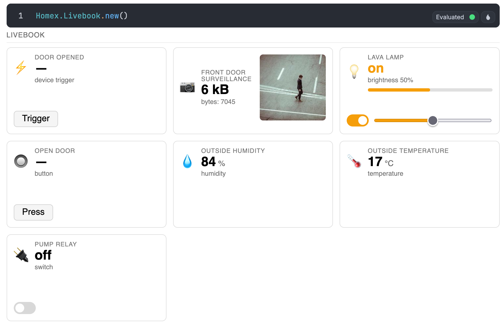

# Homex

[](https://github.com/kevinschweikert/req/actions/workflows/ci.yml)
[](https://github.com/kevinschweikert/homex/blob/main/LICENSE)
[](https://hex.pm/packages/homex)
[](https://hexdocs.pm/homex)

This library aims to bring Elixir (and especially Nerves) closer to Home Assistant. This is a work in progress based on the [initial idea](https://elixirforum.com/t/nerves-home-assistant-integration/70920).

> [!WARNING]
> Homex is being refactored towards a multi-adapter and multi-device architecture. The public API and Home Assistant compatibility will change: entity `unique_id`s change once (existing entities in Home Assistant will be re-created). Pin your version to `0.1.2` if you depend on the current behavior.

## Example

There is a Livebook example [`example.livemd`](https://livebook.dev/run?url=https://raw.githubusercontent.com/kevinschweikert/homex/refs/heads/main/example.livemd) to get you started! There is also an example repository using Nerves at https://github.com/kevinschweikert/Homex-Nerves-Example



## Installation

If [available in Hex](https://hex.pm/docs/publish), the package can be installed
by adding `homex` to your list of dependencies in `mix.exs`:

```elixir
def deps do
  [
    {:homex, "~> 0.1.2"},
    # for the MQTT adapter
    {:emqtt, "~> 1.14.7"},
    # for the ESPHome adapter
    {:espex, "~> 0.9"},
    # to advertise the ESPHome adapter with `mdns: :mdns_lite`
    {:mdns_lite, "~> 0.8"},
    # to advertise the ESPHome adapter with `mdns: :system`
    {:muontrap, "~> 2.0"},
    # for the Livebook dashboard
    {:kino, "~> 0.19"}
  ]
end
```

Homex pulls in none of these on its own. Add the ones for the adapters you use.

To build `emqtt` without QUIC support, and skip the `quicer` NIF compilation:

```elixir
{:emqtt,
 github: "emqx/emqtt",
 tag: "1.14.7",
 override: true,
 system_env: [{"BUILD_WITHOUT_QUIC", "1"}]}
```

## Usage

Supported entity types:

- Sensor
- Switch
- Light
- Camera
- Button
- DeviceTrigger

Define a module for the type of entity you want to use

```elixir
defmodule MySwitch do
  use Homex.Entity.Switch, id: :my_switch, name: "My Switch"

  def handle_on(entity) do
    IO.puts("Switch turned on")
    entity
  end

  def handle_off(entity) do
    IO.puts("Switch turned off")
    entity
  end
end
```

Add `homex` to your supervision tree with your adapters and entities. See the
`Homex.Config` module docs for the available options, `Homex.Adapter.MQTT` for
the broker settings and `Homex.Adapter.ESPHome` for the native API. Entities can
also be added/removed at runtime with `Homex.add_entity/1` or
`Homex.remove_entity/1`.

Home Assistant finds an ESPHome adapter over mDNS. Give it `mdns: :system` on a
desktop, a server or in a Livebook, and `mdns: :mdns_lite` on Nerves. Without it
you add the device to Home Assistant by its address.

```elixir
defmodule MyApp.Application do

  def start(_type, _args) do
    children =
      [
        ...,
        {Homex,
         id: Homex.hostname(),
         adapters: [
           {Homex.Adapter.MQTT,
            broker: [host: "localhost", port: 1883, username: "admin", password: "admin"]},
           {Homex.Adapter.ESPHome, mdns: :system}
         ],
         entities: [MySwitch]},
        ...
      ]

    opts = [strategy: :one_for_one, name: MyApp.Supervisor]
    Supervisor.start_link(children, opts)
  end
end
```

## Contribution

PRs and Feedback are very welcome!

## Acknowledgements and Inspiration

- [ex_homeassistant](https://github.com/Reimerei/ex_homeassistant) by @Reimerei
- [hap](https://github.com/mtrudel/hap) by @mtrudel
